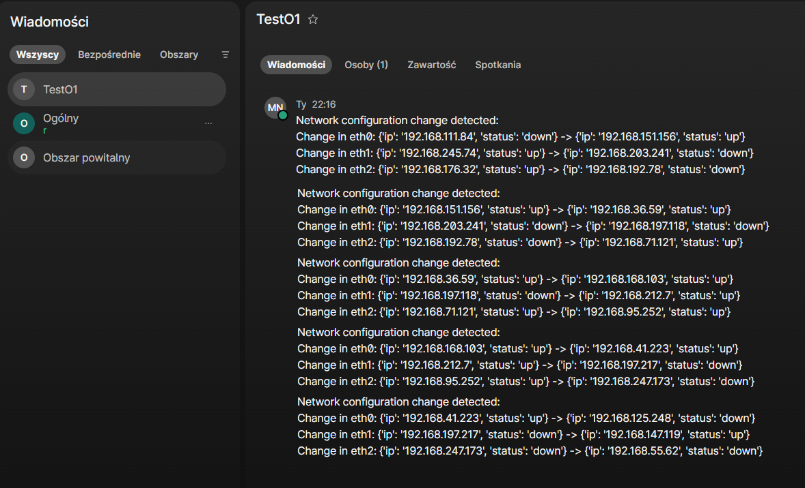

# Webex Network Configuration Notification Bot

## Opis projektu

Projekt przedstawia bota Webex, którego zadaniem jest monitorowanie zmian w konfiguracji sieci oraz wysyłanie powiadomień do platformy Webex.  
Bot działa jako automatyczny agent monitorujący (notification bot) i wykorzystuje Webex REST API do wysyłania komunikatów.  

W obecnej wersji projekt **symuluje zmiany konfiguracji interfejsów sieciowych**, jednak architektura umożliwia łatwe rozszerzenie o rzeczywiste dane z systemu operacyjnego lub urządzeń sieciowych.

---

## Wymagania

- Python 3.8+
- Konto Webex developer
- Personal Access Token Webex

### Wymagane biblioteki

```bash
pip install requests python-dotenv
```

### Setup

Uzupełnij plik .env
Jeżeli jesteś zalogowany na platformie Webex możesz użyć przycisku run aby sprawdzić ID swoich pokoi https://developer.webex.com/messaging/docs/api/v1/rooms/list-rooms 
W tym samym linku możesz równiesz skopiować API Key

### Przykładowa realizacja


